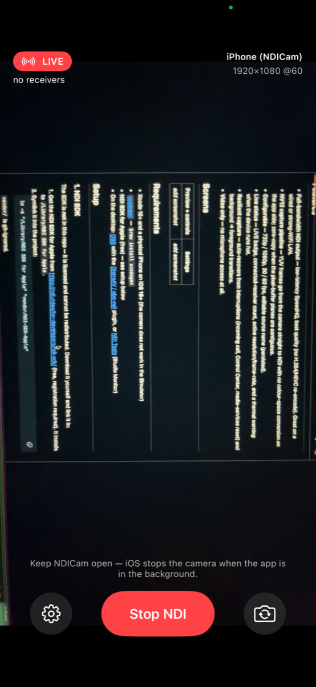
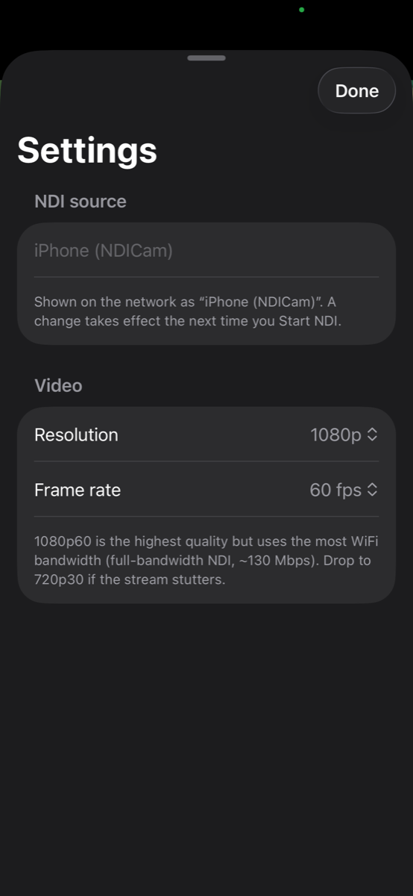

<div align="center">


# NDICam

**Turn an iPhone into a wireless NDI camera for OBS.**

iPhone camera → NDI source on your local network → OBS / vMix / NDI Studio Monitor
on the desktop. A software replacement for a capture card, over WiFi.

</div>

---

## Features

- **Full-bandwidth NDI output** — low-latency SpeedHQ, best quality (no H.264/HEVC
  re-encode). Great on a wired or strong-WiFi LAN.
- **NV12 capture pipeline** — YUV frames go from the camera straight to NDI with
  no colour-space conversion on the app side; zero-copy when the pixel-buffer
  planes are contiguous.
- **Configurable** — 720p / 1080p, 30 / 60 fps, editable source name (persisted).
- **Manual camera controls** — ISO, shutter, and white balance (temperature /
  tint), each with an auto/lock switch; slider bounds come from the device.
- **Optional web remote** — off by default; when enabled, NDICam serves a small
  self-contained control page you can add as an OBS custom browser dock.
- **Live status** — LIVE badge, connected-receiver count, active
  resolution/frame-rate, and a thermal warning when the device runs hot.
- **Resilient capture** — auto-recovers from interruptions (incoming call,
  Control Center, media-services reset) and background → foreground transitions.
- **Video only** — no microphone access at all.

## Screens

<div align="center">

&nbsp;&nbsp;

</div>

Live view shows the LIVE badge, connected-receiver count, and the active
resolution / frame rate; Settings picks resolution, frame rate, and source name.

## Requirements

- Xcode 16+ and a physical iPhone on **iOS 16+** (the camera does not work in the
  Simulator)
- [`xcodegen`](https://github.com/yonaskolb/XcodeGen) — `brew install xcodegen`
- **NDI SDK for Apple** (free) — see setup below
- On the desktop: [OBS](https://obsproject.com/) with the
  [DistroAV / obs-ndi](https://github.com/DistroAV/DistroAV) plugin, or
  [NDI Tools](https://ndi.video/tools/) (Studio Monitor)

## Setup

### 1. NDI SDK

The SDK is **not** in this repo — it is licensed and cannot be redistributed.
Download it yourself and link it in:

1. Get the **NDI SDK for Apple** from <https://ndi.video/for-developers/ndi-sdk/>
   (free, registration required). It installs to `/Library/NDI SDK for Apple`.
2. Symlink it into the project:
   ```bash
   ln -s "/Library/NDI SDK for Apple" "vendor/NDI-SDK-Apple"
   ```
   `vendor/` is git-ignored.

`project.yml` wires the SDK for the `iphoneos` SDK only (the iOS static lib has no
arm64-simulator slice, so Simulator builds compile against a no-op NDI stub):

```yaml
HEADER_SEARCH_PATHS: $(SRCROOT)/../vendor/NDI-SDK-Apple/include
"LIBRARY_SEARCH_PATHS[sdk=iphoneos*]": $(SRCROOT)/../vendor/NDI-SDK-Apple/lib/iOS
"OTHER_LDFLAGS[sdk=iphoneos*]": -lndi_ios
"GCC_PREPROCESSOR_DEFINITIONS[sdk=iphoneos*]": $(inherited) NDICAM_HAVE_NDI=1
"SWIFT_ACTIVE_COMPILATION_CONDITIONS[sdk=iphoneos*]": $(inherited) NDI_SDK_AVAILABLE
```

### 2. Generate the project & build

```bash
cd NDICam
xcodegen generate
open NDICam.xcodeproj
```

In Xcode: set your signing team (Signing & Capabilities), pick your iPhone as the
run destination, and press ⌘R. First run needs the developer certificate trusted
on the device (Settings → General → VPN & Device Management).

### 3. Use it

1. Launch NDICam on the iPhone, grant **Camera** and **Local Network** access.
2. Put the iPhone and the desktop on the same WiFi / subnet.
3. Tap **Start NDI**. Keep the app in the foreground — iOS stops the camera in the
   background.
4. In OBS: **Sources → + → NDI Source** → pick `<device name> (NDICam)`. Set
   *Latency* to `Low` for the tightest delay.

## How it works

```
AVCaptureSession ──NV12 CMSampleBuffer──▶ FrameForwarder ──▶ NDISender (Swift)
                                                                  │
                                                    NDISenderBridge (Obj-C++)
                                                                  │
                                              NDIlib_send_send_video_v2  ──▶  network
```

The regular NDI SDK compresses each frame to SpeedHQ inside `libndi` — it is
low-latency and intra-frame, but full-bitrate (~130 Mbps at 1080p60). This is not
NDI HX; there is no H.264/HEVC encoding.

### Project layout

| Path | Role |
|---|---|
| `NDICam/project.yml` | XcodeGen spec — the source of truth for the project |
| `NDICam/Sources/App/` | app entry, `ContentView`, `SettingsView`, `BroadcastSettings` |
| `NDICam/Sources/Capture/CaptureEngine.swift` | owns `AVCaptureSession`; explicit `activeFormat` selection + frame-duration lock, NV12 output, runtime-error / interruption auto-recovery, all config on a serial queue |
| `NDICam/Sources/Capture/CameraCaptureController.swift` | `@MainActor` view model + `FrameForwarder` capture delegate |
| `NDICam/Sources/Capture/CameraPreviewView.swift` | `AVCaptureVideoPreviewLayer` wrapper |
| `NDICam/Sources/NDI/NDISender.swift` | Swift handle; stub or real per `NDI_SDK_AVAILABLE` |
| `NDICam/Sources/NDI/NDISenderBridge.{h,mm}` | Obj-C++ wrapper over `NDIlib_send_*`; NV12 send (contiguous zero-copy or staged), BGRA fallback, receiver count |
| `NDICam/Sources/Capture/CameraControls.swift` | `CameraControlling` protocol + value types — the one control surface every driver (on-device UI, web remote, future NDI metadata) talks to |
| `NDICam/Sources/Remote/` | opt-in `NWListener` HTTP server + the self-contained control page it serves |

## Licensing

This project's own code has no license header yet — add one before making the repo
public if that matters to you.

The **NDI® SDK** is a separate product with its own
[license agreement](https://ndi.video/). NDI is a registered trademark of Vizrt
NDI AB. The regular SDK permits App Store distribution but requires NDI
attribution/branding in the app and its store listing — revisit before any public
release. Not relevant for personal sideloading.

## Backlog

- Manual controls **pro** tier: focus (manual + tap), zoom, lens pick,
  stabilization, EV bias, colour space; overlays (grid, focus peaking, zebra)
- Web remote: expose resolution/fps + broadcast state, tidy the dock page
- NDI HX (compressed) sender path for constrained WiFi
- Metal / vImage scaler (only if a non-native capture resolution is ever needed)
